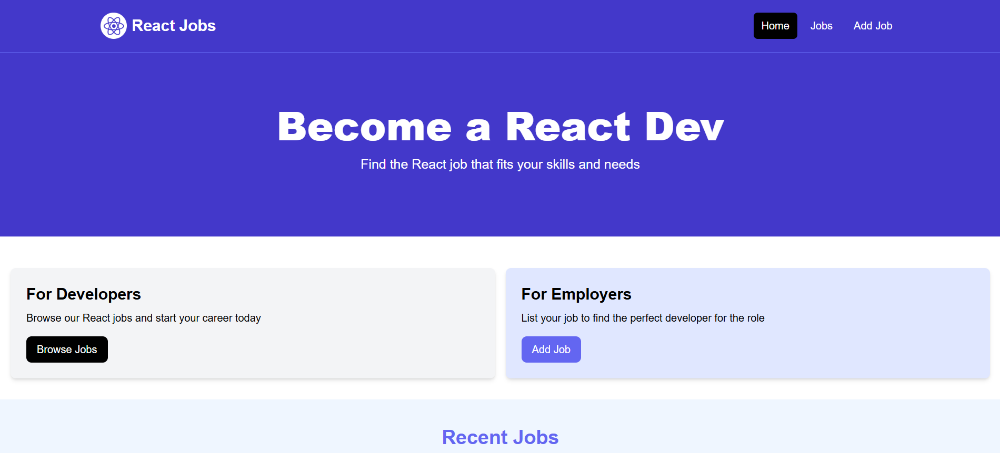

<div align="center">
  <br />
    <a href="#" target="_blank">
      
    </a>
  <br />
  
  <div>
    
    
  </div>

  <h3 align="center">React Jobs</h3>

   <div align="center">
     React Jobs is a simple platform which allows users to explore, create, update and delete jobs relating to the React technology. 
    </div>
</div>

## 📋 <a name="table">Table of Contents</a>

1. 🤖 [Introduction](#introduction)
2. ⚙️ [Tech Stack](#tech-stack)
3. 🔋 [Features](#features)
4. 🤸 [Quick Start](#quick-start)


## <a name="tech-stack">⚙️ Tech Stack</a>

- React.js
- Tailwind CSS
- JSON Server (Mockup backend)

## <a name="features">🔋 Features</a>

👉 **Browse All Jobs**: Explore a wide range of different react jobs.

👉 **Create Jobs**: Create new jobs and provide different information about the company. 

👉 **Update Jobs**: Update your own jobs or jobs that you think should be updated on the platform.

👉 **Delete Jobs**: Delete your created jobs or jobs you think are irrelavent.

## <a name="quick-start">🤸 Quick Start</a>

Follow these steps to set up the project locally on your machine.

**Prerequisites**

Make sure you have the following installed on your machine:

- [Git](https://git-scm.com/)
- [Node.js](https://nodejs.org/en)
- [npm](https://www.npmjs.com/) (Node Package Manager)

**Cloning the Repository**

```bash
git clone https://github.com/Damjan15/react-jobs
cd react-jobs
```

**Installation**

Install the project dependencies using npm:

```bash
npm install
```


**Running the Project**

```bash
npm run dev // runs the frontend
npm run server // runs the backend
```

Open [http://localhost:5173](http://localhost:5173) in your browser to view the project.